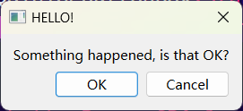
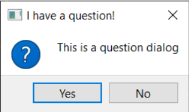

## 一 常用组件

### 1.1 基本组件

**PyQt6.QtWidgets** 包含常用GUI组件，下面我们导入了两个：

-  QApplication： app主体，一个app只能有一个
- QWidget：根组件，可以当做窗口使用

```python
from PyQt6.QtWidgets import QApplication, QWidget

import sys

app = QApplication(sys.argv)

window = QWidget()
window.show() 

app.exec()
```

`sys` 模块用于取得命令行参数，不需要时直接使用 `QApplication([])`空列表替代即可。

`app.exec()` 启动事件循环，之后我们就可以拿到用户的事件了。

除了QWidget以外，我们一般使用**QMainWindow** 作为主要窗口，也就是一直常驻的窗口，QWidget用于弹出窗口。

```python
window = QMainWindow()
window.show()
```

尝试将上面的 QWidget 替换成 QMainWindow 你会得到一样的结果。

下面我们继承 *QMainWindow* 来定制我们的窗口。

```python
class MainWindow(QMainWindow):
    def __init__(self):
        super().__init__()  

        self.setWindowTitle("My App")

        button = QPushButton("Press Me!")
		self.setFixedSize(QSize(400, 300))
        self.setCentralWidget(button)
```

`QPushButton` 是pyqt提供的按钮组件，使用`from PyQt6.QtWidgets import QPushButton`  导入。

`setCentralWidget(button)` 将 button 设置为 QMainWindow 的中间部分，QMainWindow的结构后面会讲到。

`setFixedSize` 用于设置**固定**的窗口大小**QSize** 用于表示大小，用 `from PyQt6.QtCore import QSize` 导入。 **QtCore** 模块的类是非组件的重要的类，像 QSize 不体现为具体可见的组件。


### 1.2 对话框

#### 1.2.1 Dialog


 ```python
 class CustomDialog(QDialog):
     def __init__(self):
         super().__init__()
 
         self.setWindowTitle("HELLO!")
 
         buttons = (
             QDialogButtonBox.StandardButton.Ok
             | QDialogButtonBox.StandardButton.Cancel
         )
 
         self.buttonBox = QDialogButtonBox(buttons)
         self.buttonBox.accepted.connect(self.accept)
         self.buttonBox.rejected.connect(self.reject)
 
         self.layout = QVBoxLayout()
         message = QLabel("Something happened, is that OK?")
         self.layout.addWidget(message)
         self.layout.addWidget(self.buttonBox)
         self.setLayout(self.layout)
 ```

上面我们继承 **Qdialog** 个性化了一个对话框。



**QDialogButtonBox**  指的是右下角的按钮组， 我们需要用pyqt命名空间内的常用异或来构造它。

详情参考下表：

| 按钮类型                                        | 中文 | 信号     |
| ----------------------------------------------- | ---- | -------- |
| QDialogButtonBox.Ok                             | 确定 | accepted |
| QDialogButtonBox.Cancel                         |      | rejected |
| QDialogButtonBox.Close                          |      |          |
| QDialogButtonBox.Apply                          |      |          |
| QDialogButtonBox.Discard                        |      |          |
| QDialogButtonBox.Yes                            |      |          |
| QDialogButtonBox.No                             |      |          |
| QDialogButtonBox.NoToAll QDialogButtonBox.Abort |      |          |
| QDialogButtonBox.Retry                          |      |          |
| QDialogButtonBox.Open                           |      |          |
| QDialogButtonBox.Save                           |      |          |
| QDialogButtonBox.Reset                          |      |          |
| QDialogButtonBox.RestoreDefaults                |      |          |
| QDialogButtonBox.SaveAll                        |      |          |
| QDialogButtonBox.YesToAll                       |      |          |
| QDialogButtonBox.Ignore                         |      |          |

之后我们启动对话框，并获取用户点击结果:

```python
  dlg = CustomDialog()
  if dlg.exec():
      print("Success!")
  else:
      print("Cancel!")
```


#### 1.2.2 QMessageBox


pyqt封装了常用的对话框， 通过**QMessageBox** 提供给我们。

QMessageBox 由三部分组成，图标，文本，按钮。

下面展示如何构造一个QMessageBox:

```python
  dlg = QMessageBox(self) # 创建一个QMEssageBox
  dlg.setWindowTitle("I have a question!")
  dlg.setText("This is a question dialog") # 设置文本
  dlg.setStandardButtons(
  QMessageBox.StandardButton.Yes
  | QMessageBox.StandardButton.No
  ) #设置按钮组
  dlg.setIcon(QMessageBox.Icon.Question) #设置图标
  button = dlg.exec()

  button = QMessageBox.StandardButton(button) # 解析按钮
  if button == QMessageBox.StandardButton.Yes: 
  	print("Yes!")
  else:
  	print("No!")

```

结果如下：



可选的按钮类型

| 按钮类型                    |
| --------------------------- |
| QMessageBox.Ok              |
| QMessageBox.Open            |
| QMessageBox.Save            |
| QMessageBox.Cancel          |
| QMessageBox.Close           |
| QMessageBox.Discard         |
| QMessageBox.Apply           |
| QMessageBox.Reset           |
| QMessageBox.RestoreDefaults |
| QMessageBox.Help            |
| QMessageBox.SaveAll         |
| QMessageBox.Yes             |
| QMessageBox.YesToAll        |
| QMessageBox.No              |
| QMessageBox.NoToAll         |
| QMessageBox.Abort           |
| QMessageBox.Retry           |
| QMessageBox.Ignore          |
| QMessageBox.NoButton        |

默认情况，QMessageBox拥有一个 OK 按钮。

下面是可选的图标按钮

| Icon                    |
| ----------------------- |
| QMessageBox.NoIcon      |
| QMessageBox.Question    |
| QMessageBox.Information |
| QMessageBox.Warning     |
| QMessageBox.Critical    |

对于标准的 QMessageBox pyqt提供工厂方法。

```python
QMessageBox.about(parent, title, message)
QMessageBox.critical(parent, title, message)
QMessageBox.information(parent, title, message)
QMessageBox.question(parent, title, message)
QMessageBox.warning(parent, title, message)
```


 #### 1.2.3 InputDialog


